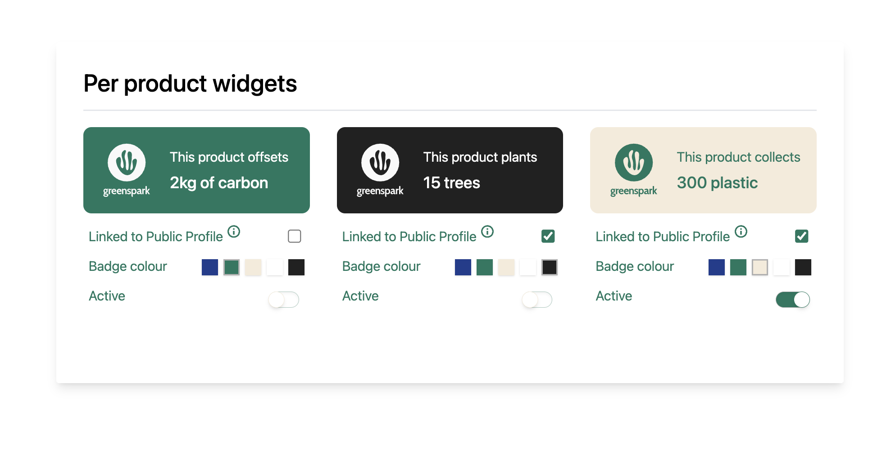

# vue-widget-app

This is a small single page application exercising skills in front-end development with responsive widget components using Vue.js, Pinia Store & Tailwind CSS with TypeScript.



A lot of the separation of the code with things such as constants and enums and how the components have been split were all to keep in mind reusability and consistency around the application now and in furutre developments.

Many of the input components have been custom built with the help of Tailwind styling to create the unique look and feel, whilst maintaining its extensibility using pure CSS. With Flowbite usage for the Tooltip interactivity.

I also attempted to reduce some of the code needed to update the Widget store data by creating a single `v-model` for the whole Widget instead of the individual properties. This enabled the components themselves to decide what and how to individually update each part of the Widget model increasings its flexibility.

Example:

```
const widgetModel = defineModel({
  get: () => mainStore.getWidgetById(props.widget.id),
  set(value: WidgetModel) {
    updateWidget(
        §props.widget.id,
        {
            ...value,
        }
    )
  },
})
```

## Project Setup

This app was build using [pmpm]{https://pnpm.io/)

```sh
pnpm install
```

### How to run in Development

```sh
pnpm dev
```

### Type-Check, Compile and Minify for Production

```sh
pnpm build
```

### Run Unit Tests with [Vitest](https://vitest.dev/)

```sh
pnpm test:unit
```
